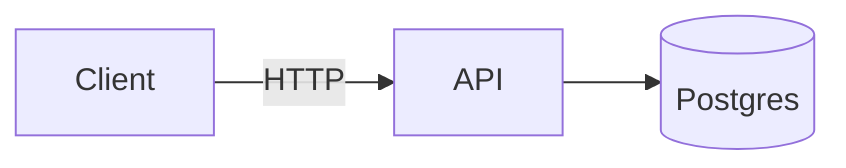

# 📚 Code Snippets Explorer

A responsive React + Tailwind app for browsing, searching, and organizing reusable code snippets across multiple languages and categories.  

Features:

- 🚀 **Dynamic Tabs** → sections auto-loaded from `snippets/sections/*.ts` or `snippets/markdown/**/*.md`
- 🔍 **Search** → filter snippets by title or code content
- 📑 **Markdown Rendering** → supports syntax highlighting (Monokai theme), GFM tables/lists, and Mermaid diagrams
- 🗂 **Grid Layout** → responsive grid that adapts to screen size; compact design for hundreds of snippets
- 📋 **Copy & Maximize** → one-click copy to clipboard and fullscreen modal view
- 📱 **Responsive** → works seamlessly on desktop, tablet, and mobile

---

## 🛠️ Tech Stack

- React (CRA)
- Tailwind CSS
- @tailwindcss/typography
- react-markdown + remark-gfm
- rehype-highlight
- mermaid
- TypeScript

---

## 📂 Project Structure

```
src/
├── App.tsx
├── index.tsx
├── styles/
│   └── index.css
│
├── components/
│   ├── CodeSnippetsApp.tsx
│   ├── SnippetCard.tsx
│   ├── Markdown.tsx
│   ├── Modal.tsx
│   └── ui/
│
├── snippets/
│   ├── types.ts
│   ├── index.ts
│   ├── mdLoader.ts
│   └── sections/
│       ├── bash.ts
│       ├── js.ts
│       ├── diagrams.ts
│       └── ...
│
├── hooks/
│   └── useClipboard.ts
│
├── utils/
│   ├── extractText.ts
│   ├── urlParams.ts
│   └── ...
│
└── types/
    └── require-context.d.ts
```

---

## 🚀 Getting Started

```bash
# install dependencies
npm install

# start dev server
npm start

# build for production
npm run build
```

---

## ✍️ Adding Snippets

### TypeScript files (`snippets/sections/`)
```ts
import type { Section } from "../types";

const section: Section = {
  id: "js",
  label: "JavaScript",
  snippets: [
    {
      id: "debounce",
      title: "Debounce",
      markdown: `
\`\`\`js
export function debounce(fn, delay = 250) {
  let t;
  return (...args) => {
    clearTimeout(t);
    t = setTimeout(() => fn(...args), delay);
  };
}
\`\`\`
      `,
    },
  ],
};

export default section;
```

### Markdown files (`snippets/markdown/`)
```
snippets/markdown/js/debounce.md
snippets/markdown/bash/find-files.md
```

Example:

```md
# Debounce

\`\`\`js
export function debounce(fn, delay = 250) {
  let t;
  return (...args) => {
    clearTimeout(t);
    t = setTimeout(() => fn(...args), delay);
  };
}
\`\`\`
```

---

## 🔎 Search & URL Params

- `?tab=js` → open directly to JavaScript tab  
- `?q=debounce` → pre-fill search box

---

## 📊 Mermaid Diagrams

````md

````

---

## 📋 Copy & Maximize

- **Copy** → copies first code block (or entire markdown)  
- **Maximize** → opens snippet in fullscreen modal  

---

## 📱 Responsive Design

- Grid auto-adjusts with `minmax`  
- Compact card layout for hundreds of snippets  
- Works on desktop, tablet, and mobile  

---

## 📜 License

MIT — free to use and modify.
